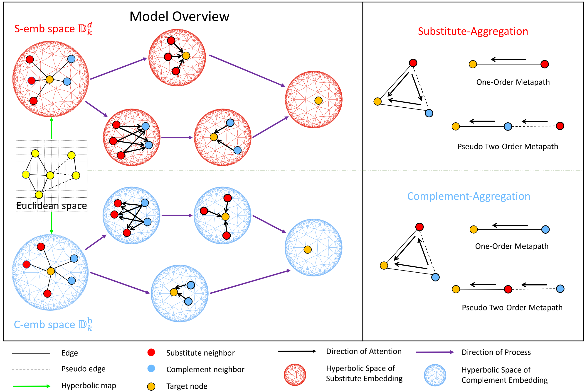

# Decoupled Hyperbolic Graph Attention Network for Modeling Substitutable and Complementary Item Relationships (CIKM 2022)

# DHGAN:

​		DHGAN is the code for our paper "Decoupled Hyperbolic Graph Attention Network for Modeling Substitutable and Complementary Item Relationships", which is published in CIKM 2022. 





## Citation:

Please cite the following paper if you use the code in any way.


# Code:

## Preprocessing

- Step1: Download meta data from https://nijianmo.github.io/amazon/index.html.
- Step2: Put the meta data file in <tt>./data_perprocess/raw_data/</tt>.
- Step3: data preprocess:

  ```shell
  cd data_perprocess
  sh run.sh
  ```


## Train and Evaluation

+ train:

  ```shell
  python main.py --run_mode=train
  ```

+ save embedding:

  ```shell
  python main.py --run_mode=save_emb
  ```

+ evaluation:

  ```shell
  python main.py --run_mode=eval
  ```
  

## Parameters

| name                | type  | options                                        | help                                                         |
| ------------------- | ----- | ---------------------------------------------- | ------------------------------------------------------------ |
| model               | str   | graphsage/gat/han/gatne/decgcn/hyperbolic      | model name                                                   |
| dataset             | str   | Electronics/Sports_and_Outdoors/Toys_and_Games | dataset name                                                 |
| graph_root_path     | str   |                                                | root path of the graph data file                             |
| graph_data_file     | str   |                                                | graph data file name                                         |
| checkpoints         | str   |                                                | path of model checkpoints                                    |
| embedding_save_path | str   |                                                | embedding save path                                          |
| log_path            | str   |                                                | log save path                                                |
| use_nodeid_emb      | bool  | True/False                                     | whether use node embedding                                   |
| nodeid_emb_dim      | int   |                                                | node embedding dims                                          |
| sparse_maxs         | str   | auto/...                                       | sparse features max values array, if 'auto', the program will automatically calculate |
| sparse_emb_dim      | str   | auto/...                                       | sparse features embedding dims, if 'auto', dims will be ceil(log2(`sparse_maxs`)) |
| hidden_dim          | int   |                                                | numbers of hidden embedding dims                             |
| output_dim          | int   |                                                | numbers of output embedding dims                             |
| train_neg_nums      | int   |                                                | numbers of train negative samples                            |
| fanout              | str   |                                                | numbers of fanout                                            |
| dropout             | float |                                                | dropout value                                                |
| num_workers         | int   |                                                | data loader workers                                          |
| previous_model      | str   | none/...                                       | previous trained model name in ./`checkpoints`_previous, 'none' means don't use previous trained model |
| train_epochs        | int   |                                                | train epochs                                                 |
| batch_size          | int   |                                                | batch size of train input data                               |
| learning_rate       | float |                                                | learning rate                                                |
| run_mode            | str   | train/save_emb/eval                            | run mode: train save embedding or evaluate                   |
| device              | str   |                                                |                                                              |
| embedding_use_model | str   |                                                | embedding use model name                                     |
| eval_neg_nums       | int   |                                                | evaluate negative sample numbers                             |
| eval_topk           | int   |                                                | choose top k to evaluate                                     |

